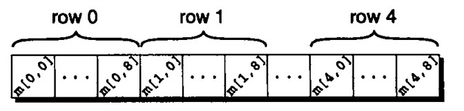

# 第八章 数组

数组是一种聚合（aggregate）变量，可以存储数值的集合。C语言中一共有两种聚合类型：数组和结构。

---

## 一维数组

数组是含有多个数据值的数据结构，并且每个数据值具有相同的数据类型。这些数据值被称为元素。

一维数组中的元素一个接一个地编排在单独一行。

声明一个一维数组：

```c
#define N 10
int a[N];
```

### 数组下标

长度为n的数组元素的索引范围是0到n-1。

使用数组元素：

```c
a[0] = 1;
```

!!!warning
	C语言不要求检查下标的范围，当下标超出范围时，程序可能执行不可预知的行为。

### 数组初始化

数组可以在声明时获得一个初始值。

数组初始化式（ array initializer ）：

```c
int a[10] = {1, 2, 3, 4, 5, 6, 7, 8, 9, 10};

/* initial value of a is {1, 2, 3, 4, 5, 6, 0, 0, 0, 0} */
int a[10] = {1, 2, 3, 4, 5, 6};

/* initial value of a is {0, 0, 0, 0, 0, 0, 0, 0, 0, 0} */
int a[10] = {0};

/* 可以忽略数组长度，编译器自行确认 */
int a[] = {1, 2, 3, 4, 5, 6, 7, 8, 9, 10};
```

### 对数组使用 sizeof 运算符

运算符 sizeof 可以确定数组的大小（字节数）。

利用 sizeof 来计算数组元素的大小：

```c
#define SIZE sizeof(a) / sizeof(a[0])
```

## 多维数组

数组可以有任意维数。

声明一个二维数组（或称为矩阵）：

```c
int m[5][9];
```

数组m有5行9列。

为了在i行j列中存取数组m的元素，需要写成`m[i][j]`的形式。

C语言按照行主序存储数组，也就是从第0行开始，接着第1行，如此下去。



### 多维数组初始化

通过嵌套一维数组的方法可以产生二维数组的初始化式：

```
int a[3][3] = {{1, 2, 3}, {4, 5, 6}, {7, 8, 9}};
```

## 常量数组

在数组定义前加const使得数组变成一个常量数组，表示不能修改数组里面的元素的值。但这样的数组必须在程序运行前就定义好数组内容，一般用于字符串数组。

```c
const int months[] = 
{ 31, 28, 31, 30, 31, 30, 31, 31, 30, 31, 30, 31 };
```